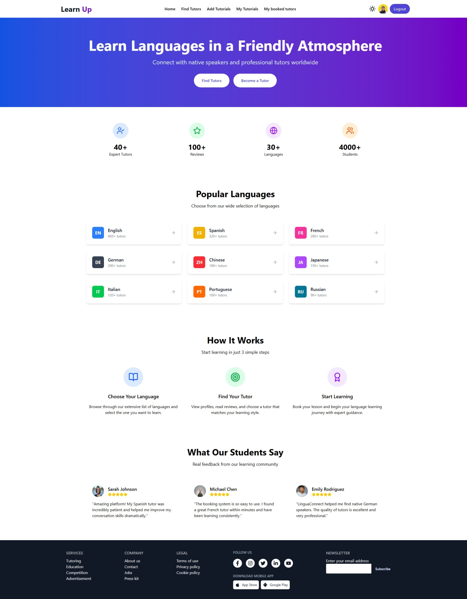

# 🌍 Language Exchange – Online Tutor Booking Platform | LearnUp



## 📝 Overview

**LearnUp** is a dynamic online platform that allows users to browse, book, and review language tutors. Users can also register as tutors to list their own tutorials. Built with React and secured via Firebase and JWT authentication, the platform includes real-time features, protected routes, and an intuitive user interface for seamless interaction between students and tutors.

---

## 🚀 Live Demo

🔗 [Visit Live Site](https://friendly-beignet-ea5754.netlify.app/)

---

## ⚙️ Technologies Used

- React
- Tailwind CSS
- React Router
- Node.js
- Express.js
- MongoDB
- Firebase Authentication
- JWT (JSON Web Token)

---

## 🌟 Key Features

- 🔍 Search and filter tutors by category, skills, or language
- 📅 Booking system with real-time database updates
- 🧑‍🏫 Add, update, and delete tutorial listings (CRUD)
- 🔐 Google Sign-In and JWT-based route protection
- 📝 Users can post reviews for tutors
- 🎨 Modern and responsive UI

---

## 📦 Dependencies

```json
"@tailwindcss/vite": "^4.1.10",
"@tanstack/react-query": "^5.80.7",
"firebase": "^11.9.1",
"lucide-react": "^0.515.0",
"react": "^19.1.0",
"react-dom": "^19.1.0",
"react-icons": "^5.5.0",
"react-router": "^7.6.2",
"react-tooltip": "^5.29.1",
"sweetalert2": "^11.22.0",
"tailwindcss": "^4.1.10",
"wouter": "^2.8.0-alpha.2"
```
🖥️ Getting Started / Local Setup
## 1.Clone the repository
```json
git clone https://github.com/naimekattor/learnUp-client.git
cd hireme
```
## 2.Install dependencies
```json
npm install

```
## 3.Run the development server
```json
npm run dev
```
## 📌 Update Instructions
Pull latest changes from the main branch:
```json
git pull origin main

```
## Reinstall new dependencies if added:
```json
npm install

```
## 🤝 Contribution Guide
Fork the repository

Create a new branch: git checkout -b feature-name

Make your changes and commit: git commit -m "Your message"

Push to your branch: git push origin feature-name

Open a Pull Request

## 🛑 Known Issues / Limitations
JWT tokens expire quickly; refresh mechanism not yet added

No real-time notifications yet for tutor bookings

## 📄 License
This project is licensed under the MIT License.

## 🙌 Acknowledgements
Firebase

React Router

SweetAlert2

Tailwind CSS

Special thanks to my mentors and the open-source community!

## 📬 Contact
Feel free to reach out if you have questions, suggestions, or collaboration ideas.

Naim Hossen
📧 Email: naimekattor@gmail.com
🌐 Portfolio: https://naim-portfolio-delta.vercel.app
💼 LinkedIn: linkedin.com/in/naimekattor
